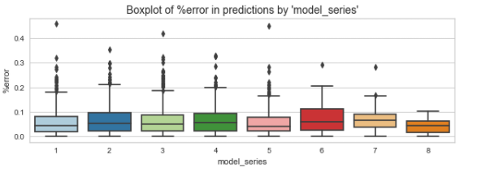

# Prediction of BMW used cars price

## 1. Project Motivation

What determines the price of used cars? The value of a car drops right from the moment it is bought and the depreciation increases with each passing year. In fact, only in the first year, the value of a car can decrease from 10 to 60 percent (Ref. 1). Different factors affect the value of a vehicle such as the mileage, model, fuel type, the condition, location, color of a car, etc.

The goals of this project are:
- explore what factors affect a sale price of used BMW cars and which characteristics are the most important to determine a car value,
- build a prototype of model which predicts price of used BMW cars.

The results of this project may be useful for businesses that work with reselling of used BWM cars and buyers who are looking to purchase a pre-owned BMW car. **Understanding the factors that determine the price and which of them have the biggest affect can help to improve the process of cars valuation.** On the one hand it can help to ensure the data with all important parameters is collected. On the other hand, it can help to save efforts on the initial steps of valuation, as only the most important car parameters can be collected to make a rough estimation of a car price or to assess how good is a particular deal of a car sale. 

**The developed sale price predictor can be of help during the process of cars search and valuation as it can be used as a tool that provides a quick rough estimation of a car price based on the given input parameters.**

## 2. The Dataset

The dataset that was chosen for the analysis contains information about BMW Used Car Sales and was obtained from DataCamp GitHub repository for careerhub data (Ref. 2). There is no information about the source of this dataset, but a conclusion was made that most likely the data was collected in the United Kingdom. There was a reference about the `tax` column as information about the road tax, in the same time miles per gallon parameter (mpg) is commonly used only in three big countries: the United States, the United Kingdom and Canada. In the United States and Canada there is no road tax as such, but in the United Kingdom there is a road tax. The values of `tax` column in the data are also correspond to tax rates in UK.

### 2.1. Dataset characteristics

The dataset consists of 10781 observations and 9 columns:
- 3 categorical variables: `model`, `transmission`, `fuelType`,
- 5 numerical variables: `year`, `engineSize`, `mileage`, `tax`, `mpg`,
- continuous target vatable `price`.

## 3. Analysis Plan

The task to be solved in this project is supervised regression problem.
In this project we will follow the steps:
- Define performance metrics based on what is known about expected performance of the model,
- Define  machine learning algorithms that may be suitable based on what is known about the task,
- Read the dataset and clean the data,
- Explore independent features relation to target, perform necessary transformations/feature engineering,
- Test regression algorithms,
- Tune a model based on the best performing algorithm,
- Implement BMW used cars predictor,
- Summarize the results and next steps to improve the model.

## 4. Performance Metrics 

Based on what is known about the data at current stage and understanding of expectations from the model performance, it is suggested to use R-Squared/RMSE as the main metrics and MAE/RMSLE as the supporting metrics. This decision is based on the assumption that big errors in price predictions should be avoided, but in the same time accuracy of predictions is also should be measured. 

**R-Squared.** R-squared (R2) is a statistical measure, known as coefficient of determination, that represents the proportion of the variance for a dependent variable that is explained by an independent variable. R-squared metric determines goodness of fit and is scaled between 0 and 1. The advantage of this metric is ease of interpretation. 

**Root Mean Squared Error (RMSE).** RMSE is the most widely used metric for regression tasks and is the square root of the averaged squared difference between the target value and the value predicted by the model. It is preferred more in some cases because the errors are first squared before averaging which poses a high penalty on large errors. This implies that RMSE is useful when large errors are undesired. 

**Mean Absolute Error (MAE).** MAE is the absolute difference between the target value and the value predicted by the model. The MAE is more robust to outliers and does not penalize the errors as extremely as RMSE. MAE is a linear score which means all the individual differences are weighted equally.

**Root Mean squared logarithmic error (RMSLE).** Root mean squared logarithmic error can be interpreted as a measure of the ratio between the true and predicted values. In a simple words we can say that RMSLE only cares about the percentual difference and therefore is robust toward outliers as it scales down big errors nullifying their effect.

## 5. Machine learning algorithms assumptions
Discussing assumptions of machine learning algorithms that are planned to be used in the project.

## 6. Read the dataset and clean the data 
### 6.1 Read the data and check descriptive statistics
### 6.2 Data cleaning

##  7. Explore independent features relation to target, perform transformations and feature engineering 

**Target variable `price`.**
-	`Price` contains a lot of outliers and it's distribution is not normal. Box-Cox transformation was applied and new target `price_transformed` was added.  

**Categorical variables `model`, `model_group`, `transmission`, `fuelType`, `engine_category`.**
- we extracted features `model_group` and `model_series` from `model`,
- `engine_category` feature analysis showed that cars with bigger engines tend to have higher price. But there are also cars with price below average among the ones with medium/big engines size, they tend to have high `mileage` values and belong to models groups `sedan_coupe_mid_size` and `sedan_style_small`.
- for all categorical features at least one group has statistically significant impact on the price. But in correlation matrix we saw that some models/model groups sub-categories don't correlate with the price, so it's necessary to explore if removing them can improve a predictive model.
- the most important features according to F-value are `transmission` (F=1258), `engine_category`(F=1032), `model_group`(F=528).

**Numerical variables: `year`, `mileage`, `tax`, `mpg`, `engineSize`, `model_series`.**
-	`year` and `mileage` features have the strongest correlation with price:

    - newer cars tend to have higher price, especially with `Hybrid` fuel type and `Automatic`/`Semi-Auto` transmission. We have relativly new cars in the dataset (from 2013 and newer). Correlation of `year` to `price` seem to be stronger for newer cars, so new boolean feature `_not_old_car` is added (for cars produced in 2013 or later).
    - different model lines seem to be in different price segments and there is a visible correlation of `mileage` and `price` within model groups.

-	`engineSize` and `model_series` features have moderate correlation with price.
    
-	`mpg` and `tax` features have the lowest correlation with the price due to non-linear relation.  
    -	as for `mpg` feature there is a pattern of it's correlation to price depending on `fuelType`: 
        - for `Petrol`/`Diesel` fuel type cars there is a moderate negative correlation of `mpg` feature and price, 
        - for cars with `Hybrid`/`Other` fuel type - there is almost no correlation with `price`. 
    -  There is a weak correlation between price and tax rate. Another finding is that `tax` feature is correlated with `mpg` and also older cars seem to have higher tax rates.

## 8. Model Development. Test regression algorithms

In this section following machine learning algorithms were tested: 
-	KNeighborsRegressor;
-	LinearRegression;
-	SGDRegressor;
-	GradientBoostingRegressor;
-	ElasticNetCV;
-	DecisionTreeRegressor;
-	RandomForestRegressor;
-	SVR;
-	AdaBoostRegressor;
-	XGBRegressor;
-	LGBMRegressor;
-	CatBoostRegressor.

## 9. Tune model based on CatBoostRegression algorithm 
### 9.1 Train CatBoostRegressor using target without transformation
Since decision trees algorithm is insensitive to the specific values of predictors, we don't have to worry about 'non-normality"'and skewed distribution of the target variable. Here we will try to use real, not transformed, values of `price`.

### 9.2 Fine-tune hyperparameters for the CatBoostRegressor
Let’s see if we can improve model performance with hyper-parameter tuning. In this project we will use RandomizedSearchCV, as it less computationally expensive than GridSearchCV and allows to check wider range of parameters. Disadvantage of this method is that search of best parameters is not exhaustive and the best combination of hyperparameters can be skipped.

We will explore the most common hyperparameters:
- number of iterations (iterations) - the maximum number of trees that can be built, defines how complex a model can be, a higher number of trees gives better performance, but model training takes more time.
- learning rate (learning_rate) - used for reducing the gradient step. It affects the overall time of training: the smaller the value, the more iterations are required for training. Increasing the learning rate can decrease overfitting, but also can cause a model to converge too quickly to a suboptimal solution.
- tree depth (depth) – setting depth of trees.
- random strength - the amount of randomness to use for scoring splits when a tree structure is selected, can be used to avoid overfitting a model.

### 9.3 Feature selection 

To define which features we can drop and which features are the most relevant it is suggested to use Recursive Feature Elimination. RFE is a wrapper-type feature that works by fitting the given machine learning algorithm, ranking features by importance, discarding the least important features and re-fitting the model. This process is repeated until a specified number of features remains. Advantage of such approach is that features importance can change after removing certain feature, so recursive refitting allows to define the least important feature on each step of the process. 

By conducting exhaustive search for the best number of features with RFE I found that reducing number of features doesn’t improve RMSE much (some very insignificant improvements may be random). Results also showed that a number of features can be reduced to up to 8 without losing much in model performance (loss increases from 2203 to 2292).

The results for the model trained only on 8 features are worse, but are still pretty good, 96% of price variance is explained by only 8 features!

### 9.4 Explore predictions of the best performing model based on  CatBoostRegressor algorithm

 

The figure above is 'Boxplot of %error in predictions by model_series', from which we can see that for all model series 75% of predictions have error about 10% or less, but there are many outliers in `%error` column. The widest interquartile range of `%error` values is for 6 model series. Median of errors are the highest for 6 and 7 model series. 19.8% of predictions have error above 10% and 7.8% have error above 15%.

## 10. Implement BMW used cars predictor using CatBoostRegressor algorithm

In this section we will define a function which predicts car price and will test it on some real world examples from the web site https://www.autotrader.co.uk.

Results of CatBoostRegressor model on the real examples from https://www.autotrader.co.uk web-site: 
 - explained_variance: 0.9341,
 - mean_absolute_error: 628.75, 
 - root_mean_squared_error: 961.897, 
 - mean_squared_log_error: 0.005877.
 
The sample for this test is not large enough to make any conclusions, but surprisingly RMSE and MSE for these 4 examples are even smaller than on the testing set. It's recommended to test the model on the bigger sample of real data.

## 11. Conclusion and Recommendations

The aim of this project was to explore what factors affect used cars price the most and to implement a prototype of used BMW cars price predictor which can provide an assistance for the potential buyers and sellers to define a fair price of a car with minimal time efforts.

### Exploration of factors that affect price of used BMW cars
The results on the test set show that only 8 parameters  can explain almost 96% of variance in price:
-	Year when car was produced (importance_score – 29.7),
-	Number in model name (importance_score – 17.7),
-	Mileage (importance_score – 15.8),
-	Mileage per gallon parameter (importance_score – 13.2),
-	Boolean parameter `_big_engine_auto_semi_auto` which is True when a car has automatic or semi-automatic transmission and engine size above 2.9 liters (importance_score – 7.9),
-	Boolean parameter which is True when a car belongs to `X` model line (importance_score – 7.3),
-	Size of engine in liters (importance_score – 4.5),
-	Added feature `mpg_2` which is filled if ` fuelType` is ` Diesel` (importance_score – 3.9).

In other words we can conclude that all the features except `tax`, that were in the initial dataset proved are important for price prediction: `year`, `model`, `mileage`, `mpg`, `transmission`, `engineSize` and `fuelType`. 

### Prototype of price predictor for used BMW cars 

In this project several machine learning algorithms were tested and different data preprocessing approaches were explored. New features were extracted from the initial data. Data was spit into training (80%) and testing (20%) set.

Predictive model based on CatBoostRegressor algorithm had the best results on the test set:
 - explained_variance: 0.9631,
 - mean_absolute_error: 1435.5959, 
 - root_mean_squared_error: 2202.7952, 
 - mean_squared_log_error: 0.008453.

To check the model performance on the real data, 4 inputs of samples from [autotrader.co.uk](https://www.autotrader.co.uk) web-site were manually added and price were predicted for them. The results we got are: RMSE of £962 and MAE of £629 which is better than on training or testing set. The sample size for this test is not large enough to make any conclusions, so it's recommended to check model performance on the bigger sample and analyze the results.

**Limitations of the price prediction model:**
1.	Results of the best performing model on the test set are: mean absolute error of £1436  and mean squared error of £2203. There are about 20% of predictions that have error above 10% and almost 8% of predictions have error above 15%. It’s important to define what are minimal requirements for the model performance, because the current model's predictions might not be reliable enough.
2.	CatBoostRegressor algorithm provided the best results on the test set, but is more computationally expensive than other simpler algorithms with slightly bigger loss. Amount of data to be processed and the expected execution time should be taken into consideration when applying price prediction model.
3.	Cars sales data quickly gets irrelevant with time: demand on the market changes, new models are released and with each time period cars loose in value because their age increases, etc. The price predictor should be updated regularly to provide relevant predictions.

**Possible ways to improve performance of the model:**

1.	Explore in greater depth hyperparameter tuning for CatBoostRegressor. 
2.	Some values of price are not explained by the parameters that we have in the dataset. It’s possible that more information about cars can be retrieved that can explain unclear variance in price, for example: 
    -	assessment of car condition, 
    -	more information about important car characteristics (engine model, color, if navigation is installed, leather/textile interior, if car is convertible, number of doors, if a car was in accident and what was a severity of damage, if a car had more than one owner, etc),
    -	information about additional packages/additions installed in a car or assessment of value of additions/packages,
    -	location, etc. 
3. Collect more data (for example in the dataset there is not much data for the older cars).
4. Explore model performance on the real unseen data and tune it in accordance to received results.